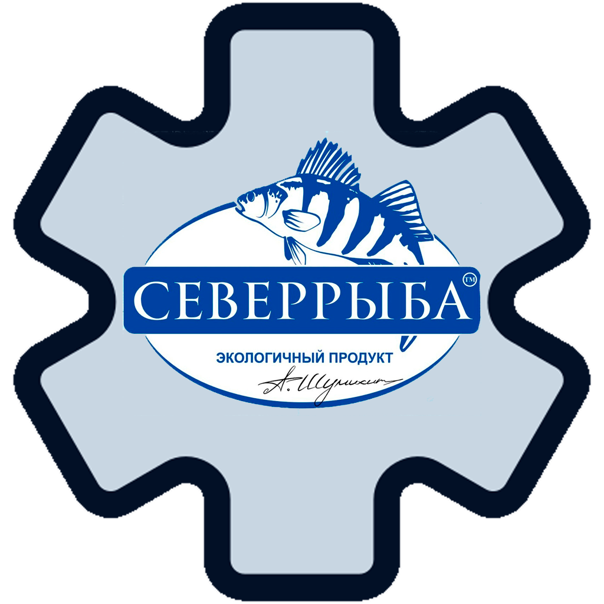

# [AIS](https://github.com/Y3ppi3/NorthFish/tree/main/ais) + [Sever-Fish](https://github.com/Y3ppi3/NorthFish/tree/main/Sever-Fish) + [api-gateway](https://github.com/Y3ppi3/NorthFish/tree/main/api-gateway)

<div align="center">
  
  
  <p><strong>Automatic Information System [AIS](Автоматическая Информационная Система)</strong></p>
  
  
  
  
</div>

## 📋 Обзор проекта

Данный проект представляет собой комплексное решение для управления рыбным производством и магазином "Север-Рыба". Система состоит из нескольких компонентов:

1. **Sever-Fish** - Клиентская часть для покупателей (фронтенд и бэкенд)
2. **AIS (Административная Информационная Система)** - Система управления для сотрудников (фронтенд и бэкенд)
3. **API Gateway** - Интеграционный слой между системами

## ✨ Основные функциональности

### Клиентская часть (Sever-Fish)
- Каталог товаров
- Корзина покупок
- Оформление заказов
- Личный кабинет пользователя
- История заказов

### Административная часть (AIS)
- Управление товарами и категориями
- Управление заказами
- Аналитика продаж
- Синхронизация данных между системами
- Управление пользователями

## Архитектура решения

```
┌─────────────────┐    ┌─────────────────┐
│                 │    │                 │
│  Sever-Fish     │    │  AIS            │
│  Frontend       │    │  Frontend       │
│  (Клиентская    │    │  (Админ-        │
│   часть)        │    │   панель)       │
│                 │    │                 │
└────────┬────────┘    └────────┬────────┘
         │                      │
         │                      │
         │                      │
┌────────▼────────┐    ┌────────▼────────┐
│                 │    │                 │
│  Sever-Fish     │    │  AIS            │
│  Backend        │    │  Backend        │
│  (API)          │    │  (API)          │
│                 │    │                 │
└────────┬────────┘    └────────┬────────┘
         │                      │
         └──────────┬───────────┘
                    │
          ┌─────────▼─────────┐
          │                   │
          │   API Gateway     │
          │                   │
          └─────────┬─────────┘
                    │
          ┌─────────▼─────────┐
          │                   │
          │   PostgreSQL DB   │
          │                   │
          └───────────────────┘
```

## Технологический стек

### Фронтенд
- **React** + **TypeScript**
- **TailwindCSS** для стилизации
- **Vite** для сборки

### Бэкенд
- **FastAPI** (Python)
- **SQLAlchemy** для ORM
- **Alembic** для миграций

### Интеграция
- **API Gateway** на FastAPI

### База данных
- **PostgreSQL**

### Контейнеризация
- **Docker**

## 📸 Демонстрация

<div align="center">
  <details>
    <summary>📱 Скриншоты (нажмите, чтобы развернуть)</summary>
    <p>Главная страница</p>
    
    <p>ФУНКЦИЯ 1</p>
    
    <p>ФУНКЦИЯ 2</p>
    
    <p>ФУНКЦИЯ 3</p>
  </details>
</div>


## ▶️ Начало работы

### Предварительные требования

- Python 3.9+
- Node.js 16+
- PostgreSQL 13+

## Установка и запуск

## Запуск с Docker-ом

### Основные операции

### Запуск билда
```
docker-compose build
```

### Запуск контейнеров
```
docker-compose up -d
```

### Выключение контейнеров
```
docker-compose down
```

---

### Доступ к БД
```
docker exec -it northfish-db psql -U northf_user -d north_fish
```

---

### Операции с БД

### Alembic
```
docker exec -it ais-backend bash -c "cd /app && alembic upgrade head"
```

### Заполнение данных в БД с использованием `seed_db.py`
```
docker cp D:\.dev\NF\ais\ais-backend\seed_db.py ais-backend:/app/   
```
``` 
docker exec -it ais-backend bash -c "cd /app && python seed_db.py"
```

---

## ЗАПУСК БЕЗ Docker-а

## Операции с БД

### Указываем envPath если не указан в Windows
```
$env:Path += ";C:\Program Files\PostgreSQL\17\bin"
```

### Доступ к БД
```
psql -U katarymba -d sever_ryba_db -h localhost -p 5432
```

---

## Основные команды для запуска компонентов проекта

### api-gateway
```
cd api-gateway
.venv\Scripts\activate
python -m uvicorn main:app --host 0.0.0.0 --port 8080 --reload
```


### AIS
``` ais-backend 
cd ais/ais-backend
.venv\Scripts\activate
uvicorn app.main:app --reload --host 0.0.0.0 --port 8001
```
``` ais-frontend
cd ais/ais-frontend
npm run dev
```

### Sever-Fish
``` Sever-Fish/backend 
cd Sever-Fish/backend
.venv\Scripts\activate
uvicorn app.main:app --reload --host 0.0.0.0 --port 8000
```
``` ais-frontend
cd Sever-Fish/frontend
npm run dev
```

### 🚀 Быстрый запуск через скрипты (Windows)

Для удобства в проекте есть bat-файлы:

```
run-all.bat           # Запускает все компоненты
run-ais-backend.bat   # Запускает только AIS бэкенд
run-ais-frontend.bat  # Запускает только AIS фронтенд
run-api-gateway.bat   # Запускает API Gateway
run-sever-ryba-frontend.bat  # Запускает клиентский фронтенд
```

## 📁 Структура проекта

```
/NF
├── Sever-Fish/              # Клиентская часть
│   ├── backend/             # API для клиентского приложения
│   │   ├── migrations/      # Миграции БД
│   │   ├── models.py        # Модели данных
│   │   ├── routers/         # Эндпоинты API
│   │   ├── schemas.py       # Схемы валидации Pydantic
│   │   └── main.py          # Точка входа
│   │
│   └── frontend/            # Клиентский веб-интерфейс
│       ├── public/          # Статические файлы
│       └── src/             # Исходный код React
│
├── ais/                     # Административная система
│   ├── ais-backend/         # API для админки
│   │   ├── app/             # Основной код
│   │   │   ├── models.py    # Модели данных
│   │   │   ├── routers/     # Эндпоинты API
│   │   │   └── schemas.py   # Схемы Pydantic
│   │   └── alembic/         # Миграции БД
│   │
│   └── ais-frontend/        # Административный веб-интерфейс
│       ├── public/          # Статические файлы
│       └── src/             # Исходный код React
│
├── api-gateway/             # Интеграционный слой
│   └── main.py              # Код API Gateway
│
└── *.bat                    # Скрипты для запуска компонентов
```


## 🛠 Разработка

### Добавление новых миграций

### Sever-Fish
```bash
cd Sever-Fish/backend
alembic revision --autogenerate -m "описание изменений"
alembic upgrade head
```

#### AIS
```bash
cd ais/ais-backend
alembic revision --autogenerate -m "описание изменений"
alembic upgrade head
```

### Доступ к API и Frontend-у

| Сервис	          | URL                       |
| ------------------- |:-------------------------:|
|Sever-Fish API       | http://localhost:8000/    |
| AIS API             | http://localhost:8001/    |
| API Gateway         | http://localhost:8080/    |
| Sever-Fish frontend | http://localhost:5173/    |
| AIS frontend        | http://localhost:5174/    |

## 📇 Базовые данные для входа

#### AIS (административная панель)
- Username: admin
- Password: admin123


## 📄 Лицензия

Этот проект распространяется под лицензией MIT. Подробности смотрите в файле [MIT LICENSE](https://github.com/Y3ppi3/NorthFish/blob/main/LICENSE)

## 👨‍💻 Авторы

[katarymba](https://github.com/katarymba), [Y3ppi3](https://github.com/Y3ppi3)
