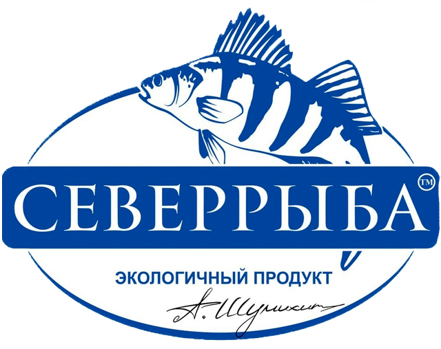

# Север-Рыба: Система управления и клиентская часть



## Обзор проекта

Данный проект представляет собой комплексное решение для управления рыбным производством и магазином "Север-Рыба". Система состоит из нескольких компонентов:

1. **Sever-Fish** - Клиентская часть для покупателей (фронтенд и бэкенд)
2. **AIS (Административная Информационная Система)** - Система управления для сотрудников
3. **API Gateway** - Интеграционный слой между системами

## Архитектура решения

```
┌─────────────────┐    ┌─────────────────┐
│                 │    │                 │
│  Sever-Fish     │    │  AIS            │
│  Frontend       │    │  Frontend       │
│  (Клиентская    │    │  (Админ-        │
│   часть)        │    │   панель)       │
│                 │    │                 │
└────────┬────────┘    └────────┬────────┘
         │                      │
         │                      │
         │                      │
┌────────▼────────┐    ┌────────▼────────┐
│                 │    │                 │
│  Sever-Fish     │    │  AIS            │
│  Backend        │    │  Backend        │
│  (API)          │    │  (API)          │
│                 │    │                 │
└────────┬────────┘    └────────┬────────┘
         │                      │
         └──────────┬───────────┘
                    │
          ┌─────────▼─────────┐
          │                   │
          │   API Gateway     │
          │                   │
          └─────────┬─────────┘
                    │
          ┌─────────▼─────────┐
          │                   │
          │   PostgreSQL DB   │
          │                   │
          └───────────────────┘
```

## Технологический стек

### Фронтенд
- **React** + **TypeScript**
- **TailwindCSS** для стилизации
- **Vite** для сборки

### Бэкенд
- **FastAPI** (Python)
- **SQLAlchemy** для ORM
- **Alembic** для миграций

### Интеграция
- **API Gateway** на FastAPI

### База данных
- **PostgreSQL**

## Начало работы

### Предварительные требования

- Python 3.9+
- Node.js 16+
- PostgreSQL 13+

### Установка и запуск

#### 1. Клонирование репозитория

```bash
git clone https://your-repository-url/nf.git
cd nf
```

#### 2. Настройка окружения для бэкенда

##### Sever-Fish Бэкенд
```bash
cd Sever-Fish/backend
python -m venv .venv
source .venv/bin/activate  # На Windows: .venv\Scripts\activate
pip install -r requirements.txt

# Настройка БД
alembic upgrade head

# Запуск сервера
python main.py
```

##### AIS Бэкенд
```bash
cd ais/ais-backend
python -m venv .venv
source .venv/bin/activate  # На Windows: .venv\Scripts\activate
pip install -r requirements.txt

# Настройка БД
alembic upgrade head

# Создание администратора
python init_admin.py

# Запуск сервера
uvicorn app.main:app --reload
```

#### 3. Настройка окружения для фронтенда

##### Sever-Fish Фронтенд
```bash
cd Sever-Fish/frontend
npm install
npm run dev
```

##### AIS Фронтенд
```bash
cd ais/ais-frontend
npm install
npm run dev
```

#### 4. Настройка API Gateway

```bash
cd api-gateway
python -m venv .venv
source .venv/bin/activate  # На Windows: .venv\Scripts\activate
pip install -r requirements.txt

# Запуск
uvicorn main:app --reload
```

### Быстрый запуск через скрипты (Windows)

Для удобства в проекте есть bat-файлы:

```
run-all.bat           # Запускает все компоненты
run-ais-backend.bat   # Запускает только AIS бэкенд
run-ais-frontend.bat  # Запускает только AIS фронтенд
run-api-gateway.bat   # Запускает API Gateway
run-sever-ryba-frontend.bat  # Запускает клиентский фронтенд
```

## Структура проекта

```
/NF
├── Sever-Fish/              # Клиентская часть
│   ├── backend/             # API для клиентского приложения
│   │   ├── migrations/      # Миграции БД
│   │   ├── models.py        # Модели данных
│   │   ├── routers/         # Эндпоинты API
│   │   ├── schemas.py       # Схемы валидации Pydantic
│   │   └── main.py          # Точка входа
│   │
│   └── frontend/            # Клиентский веб-интерфейс
│       ├── public/          # Статические файлы
│       └── src/             # Исходный код React
│
├── ais/                     # Административная система
│   ├── ais-backend/         # API для админки
│   │   ├── app/             # Основной код
│   │   │   ├── models.py    # Модели данных
│   │   │   ├── routers/     # Эндпоинты API
│   │   │   └── schemas.py   # Схемы Pydantic
│   │   └── alembic/         # Миграции БД
│   │
│   └── ais-frontend/        # Административный веб-интерфейс
│       ├── public/          # Статические файлы
│       └── src/             # Исходный код React
│
├── api-gateway/             # Интеграционный слой
│   └── main.py              # Код API Gateway
│
└── *.bat                    # Скрипты для запуска компонентов
```

## Основные функциональности

### Клиентская часть (Sever-Fish)
- Каталог товаров
- Корзина покупок
- Оформление заказов
- Личный кабинет пользователя
- История заказов

### Административная часть (AIS)
- Управление товарами и категориями
- Управление заказами
- Аналитика продаж
- Синхронизация данных между системами
- Управление пользователями

## Разработка

### Добавление новых миграций

#### Sever-Fish
```bash
cd Sever-Fish/backend
alembic revision --autogenerate -m "описание изменений"
alembic upgrade head
```

#### AIS
```bash
cd ais/ais-backend
alembic revision --autogenerate -m "описание изменений"
alembic upgrade head
```

### Доступ к API

- Sever-Fish API: http://localhost:8000
- AIS API: http://localhost:8001
- API Gateway: http://localhost:8080

### Документация API

- Sever-Fish API: http://localhost:8000/docs
- AIS API: http://localhost:8001/docs
- API Gateway: http://localhost:8080/docs

## Данные для входа

### AIS (административная панель)
- Username: main_admin
- Password: qwerty123

## Лицензия

[Укажите лицензию Вашего проекта]

## Авторы

[Ваша информация]